<p align="center">
  
</p>

<p align="center">
  <a href="mailto:jessforwork2023@gmail.com"></a>
  <a href="https://github.com/Ryotess?tab=repositories"></a>
  
</p>

## `01 // IDENTITY`

```console
ryotess@taipei:~$ whoami
AI/ML Engineer + Data Scientist

ryotess@taipei:~$ cat education.log
M.S. @ NCCU STAT  |  B.S. @ NTUE MIE

ryotess@taipei:~$ echo $MISSION
Turn data, models, and infrastructure into systems people can actually use.
```

I build at the intersection of **machine learning**, **data**, and **software engineering** — from experiments and recommendation systems to production-oriented APIs and cloud infrastructure.

## `02 // TOOLBOX`

<p>
  
  
  
  
  
  
  
  
</p>

## `03 // SELECTED BUILDS`

| SYSTEM | MISSION | CORE |
| :--- | :--- | :--- |
| **[fastapi-microservice-template](https://github.com/Ryotess/fastapi-microservice-template)** | A clean, production-oriented FastAPI foundation for AI-friendly teams. | `Python` `FastAPI` |
| **[terraform-gcp-mlflow](https://github.com/Ryotess/terraform-gcp-mlflow)** | Infrastructure as code for running MLflow on Google Cloud. | `Terraform` `GCP` `MLflow` |
| **[Pic2Recipe](https://github.com/Ryotess/Pic2Recipe--A_yolov8_based_recipe_recommender)** | Turns food images into recipe recommendations with YOLOv8. | `Python` `Computer Vision` |
| **[PyOpenverse](https://github.com/Ryotess/PyOpenverse)** | A Python image-search engine built on the Openverse ecosystem. | `Python` `Search` |
| **[KKBOX Recommendation System](https://github.com/Ryotess/KKBOX_Music_Recommendation_System)** | A solution for the WSDM KKBOX Music Recommendation Challenge. | `ML` `Recommender Systems` |

## `04 // OFFLINE MODE`

When I am away from the terminal, you can usually find me with a **camera**, a **guitar**, or at the **gym**.

```text
[ PHOTOGRAPHY ]  [ GUITAR ]  [ BODYBUILDING ]
```

## `05 // ESTABLISH CONNECTION`

```console
visitor@github:~$ connect --with ryotess
> channel ready: jessforwork2023@gmail.com
> location: Taipei, Taiwan
> status: awaiting your signal...
```

<p align="center">
  <sub><code>NO TRACKERS // NO NOISE // JUST BUILDING</code></sub>
</p>
