<p align="center">
  
</p>

<p align="center">
  <a href="https://www.linkedin.com/in/shaoyanchen/"></a>
  <a href="mailto:jessforwork2023@gmail.com"></a>
  <a href="https://github.com/Ryotess?tab=repositories"></a>
  
</p>

## `01 // IDENTITY`

```console
ryotess@taipei:~$ whoami
Machine Learning Engineer // Applied AI Engineer

ryotess@taipei:~$ echo $FOCUS
Production LLM Agents // Search // Recommender Systems

ryotess@taipei:~$ cat current_assignment.log
LITEON / Cedars Digital  |  Taipei, Taiwan
```

I build and ship **production AI/ML systems end to end** — from research and system design to data and API development, evaluation, CI/CD, and cloud deployment.

## `02 // PRODUCTION SIGNALS`

| `98%` | `95%` | `~400K` | `>95%` |
| :---: | :---: | :---: | :---: |
| Expert-validated<br>Top-1 accuracy | User<br>acceptance rate | Emission factors<br>searched & ranked | Document parsing<br>& extraction accuracy |

Currently building a commercial **B2B CBAM analytics agent** and a hybrid search and recommendation system that turns regulatory data into fast, traceable decisions.

## `03 // TOOLBOX`

<p>
  
  
  
  
  
  
  
  
  
  
</p>

```text
AGENTS     LangGraph  ·  LangChain  ·  ReAct  ·  RAG  ·  MCP  ·  Guardrails
RETRIEVAL  BM25  ·  Vector Search  ·  HNSW  ·  RRF  ·  Neural Reranking
PLATFORM   FastAPI  ·  PostgreSQL  ·  GKE  ·  Cloud Run  ·  vLLM  ·  CI/CD
```

## `04 // EXPERIENCE LOG`

**`2024.11 — NOW` · AI/ML Engineer · LITEON**

- Designed and launched hybrid search and recommendation across approximately **400K emission factors**, reaching **98% expert-validated Top-1 accuracy** and **95% user acceptance**.
- Developed the AI layer of a commercial B2B CBAM analytics agent with regulatory Q&A, emissions analysis, interactive visualizations, downloadable reports, and decarbonization recommendations.
- Shipped asynchronous FastAPI and PostgreSQL services on GCP with GKE, Cloud Run, Docker, Kubernetes, vLLM, MLflow, and CI/CD.

**`2023.12 — 2024.10` · AI/ML Engineer · Lion Travel**

- Built three production LLM applications spanning internal support, visa processing, and personalized itinerary planning.
- Reduced support workload by **40%** and visa-processing workload by **50%** through fine-tuning, hybrid retrieval, RAG, and agent routing.
- Delivered a geography-aware itinerary planner selected as a **Top 5 LLM application** by the Taiwan Artificial Intelligence Association.

**`2022.09 — 2023.09` · Data Scientist · The News Lens**

- Automated audience and brand analytics workflows, cutting turnaround time from **3–4 days to under 30 minutes**.
- Built NLP pipelines with BERT and reusable data products using Spotify, YouTube, and BigQuery data.

**`2022.09 — 2023.06` · Research Assistant · National Chengchi University**

## `05 // PUBLIC BUILDS`

| SYSTEM | MISSION | CORE |
| :--- | :--- | :--- |
| **[fastapi-microservice-template](https://github.com/Ryotess/fastapi-microservice-template)** | A clean, production-oriented FastAPI foundation for AI-friendly teams. | `Python` `FastAPI` |
| **[terraform-gcp-mlflow](https://github.com/Ryotess/terraform-gcp-mlflow)** | Infrastructure as code for running MLflow on Google Cloud. | `Terraform` `GCP` `MLflow` |
| **[Pic2Recipe](https://github.com/Ryotess/Pic2Recipe--A_yolov8_based_recipe_recommender)** | Turns food images into recipe recommendations with YOLOv8. | `Python` `Computer Vision` |
| **[PyOpenverse](https://github.com/Ryotess/PyOpenverse)** | A Python image-search engine built on the Openverse ecosystem. | `Python` `Search` |
| **[KKBOX Recommendation System](https://github.com/Ryotess/KKBOX_Music_Recommendation_System)** | A solution for the WSDM KKBOX Music Recommendation Challenge. | `ML` `Recommender Systems` |

## `06 // CREDENTIALS`

| YEAR | SIGNAL | RESULT |
| :--- | :--- | :--- |
| `2025` | SinoPac Bank AIGO Competition | **13th of 868 teams** · F1 `0.8625` · Technical lead |
| `2024` | Taiwan Artificial Intelligence Association | **Top 5** LLM-powered application |

```console
ryotess@taipei:~$ cat education.log
M.S. Statistics + second specialty in Computer Science  |  NCCU  |  GPA 4.0
B.S. Mathematics and Information Education             |  NTUE  |  GPA 4.0
```

## `07 // OFFLINE MODE`

When I am away from the terminal, you can usually find me with a **camera**, a **guitar**, or at the **gym**.

```text
[ PHOTOGRAPHY ]  [ GUITAR ]  [ BODYBUILDING ]
```

## `08 // ESTABLISH CONNECTION`

```console
visitor@github:~$ connect --with ryotess
> linkedin: linkedin.com/in/shaoyanchen
> email: jessforwork2023@gmail.com
> location: Taipei, Taiwan
> status: awaiting your signal...
```

<p align="center">
  <sub><code>NO TRACKERS // NO NOISE // JUST BUILDING</code></sub>
</p>
