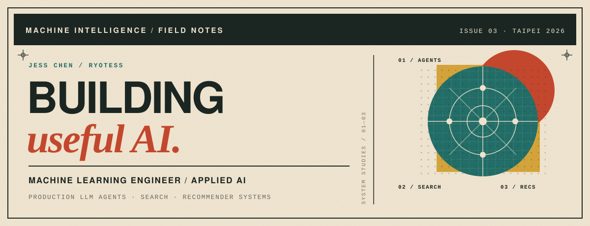

  

  <a href="https://www.linkedin.com/in/shaoyanchen/">LINKEDIN</a>
  &nbsp;·&nbsp;
  <a href="mailto:jessforwork2023@gmail.com">EMAIL</a>
  &nbsp;·&nbsp;
  <a href="https://github.com/Ryotess?tab=repositories">PUBLIC WORK</a>

### — PRACTICE

**I build AI systems that survive contact with production.**

At **LITEON / Cedars Digital**, I work end to end across research, system design, data and API development, evaluation, CI/CD, and cloud deployment. My focus is production LLM agents, search, and recommender systems that turn complex information into useful decisions.

### — SELECTED SIGNALS

| **98%** | **95%** | **~400K** |
| :---: | :---: | :---: |
| expert-validated Top-1 accuracy | user acceptance rate | emission factors searched and ranked |

### — SYSTEMS IN PRODUCTION

**01 · Hybrid emission-factor search & recommendation** 
Compliance filtering, BM25 and vector retrieval, HNSW, reciprocal-rank fusion, and neural reranking — reducing factor selection from minutes to seconds.

**02 · Commercial B2B CBAM analytics agent** 
Regulatory Q&A, emissions and certificate-cost analysis, hotspot detection, interactive visualizations, downloadable reports, and decarbonization recommendations in one agentic workflow.

**03 · LLM applications for travel operations** 
Fine-tuning, hybrid retrieval, RAG, and agent routing across internal support, visa processing, and itinerary planning — reducing operational workload by 40–50%.

### — OPEN-SOURCE NOTES

| PROJECT | NOTE |
| :--- | :--- |
| **[fastapi-microservice-template](https://github.com/Ryotess/fastapi-microservice-template)** | A production-oriented FastAPI foundation for AI-friendly teams. |
| **[terraform-gcp-mlflow](https://github.com/Ryotess/terraform-gcp-mlflow)** | Infrastructure as code for running MLflow on Google Cloud. |
| **[Pic2Recipe](https://github.com/Ryotess/Pic2Recipe--A_yolov8_based_recipe_recommender)** | A YOLOv8 ingredient detector and recipe recommender. |
| **[KKBOX Recommendation System](https://github.com/Ryotess/KKBOX_Music_Recommendation_System)** | A Top 25% solution for the WSDM KKBOX challenge. |

### — WORKING SET

**Agents** — LangGraph, LangChain, ReAct, RAG, MCP, guardrails, DeepEval 
**Retrieval** — BM25, vector search, HNSW, RRF, neural reranking 
**Platform** — Python, FastAPI, PostgreSQL, GCP, GKE, Cloud Run, Kubernetes, Docker, vLLM, MLflow, CI/CD

### — EXPERIENCE

| PERIOD | ROLE | STUDIO |
| :--- | :--- | :--- |
| `2024.11 — NOW` | AI/ML Engineer | LITEON |
| `2023.12 — 2024.10` | AI/ML Engineer | Lion Travel |
| `2022.09 — 2023.09` | Data Scientist | The News Lens |
| `2022.09 — 2023.06` | Research Assistant | National Chengchi University |

### — EDUCATION & DISTINCTIONS

**M.S. Statistics**, second specialty in Computer Science — National Chengchi University, GPA 4.0 
**B.S. Mathematics and Information Education** — National Taipei University of Education, GPA 4.0

`2025` **13th / 868 teams**, SinoPac Bank AIGO Competition · F1 0.8625 · technical lead 
`2024` **Top 5 LLM-powered application**, Taiwan Artificial Intelligence Association

---

  Photography &nbsp;·&nbsp; Guitar &nbsp;·&nbsp; Bodybuilding  
  <code>FIELD NOTES №03 · TAIPEI · 2026</code>

